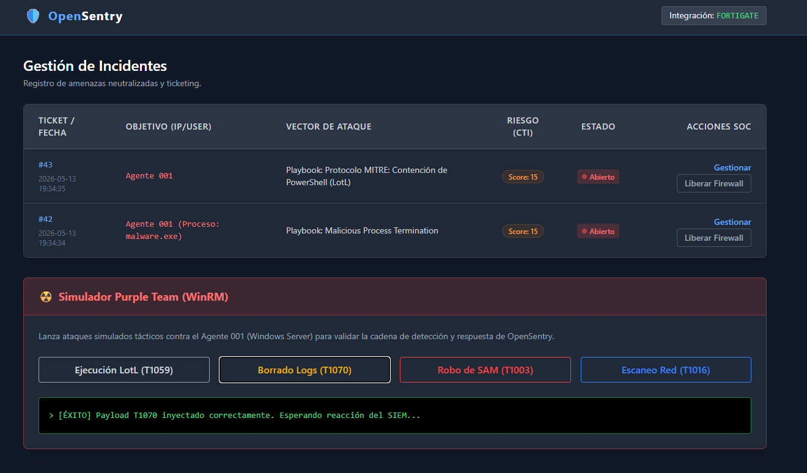
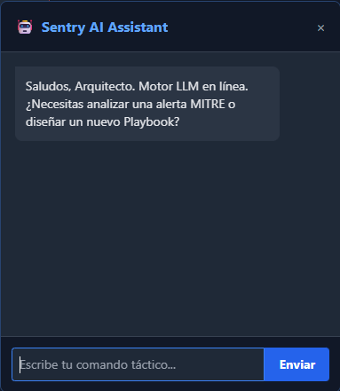
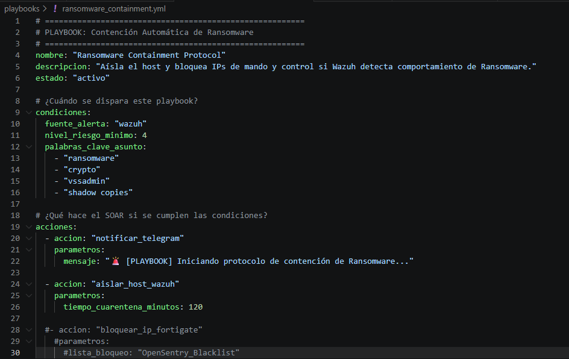
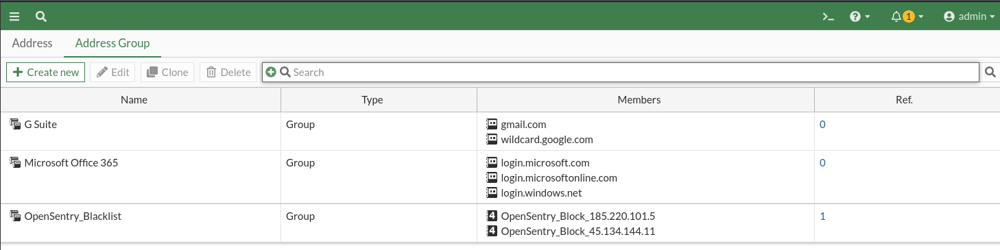
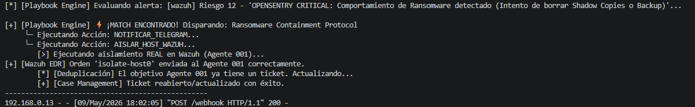
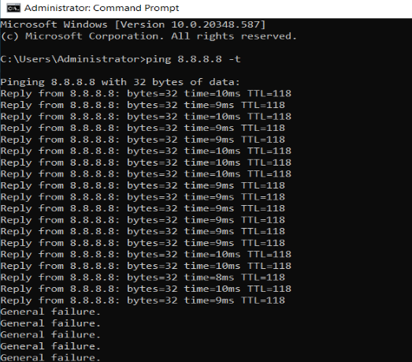

# 🛡️ OpenSentry SOAR

> **Status:** 🚧 In Active Development / En Desarrollo | **Version:** 0.6.0-alpha

## 📖 Visión General del Proyecto
**OpenSentry** es una plataforma SOAR (Security Orchestration, Automation, and Response) personalizada y de código abierto. Está diseñada para automatizar el ciclo de vida de respuesta a incidentes (DFIR) y reducir la fatiga de alertas de los analistas de Nivel 1 (L1 SOC Analysts).

El objetivo de este proyecto es demostrar cómo integrar de forma programática soluciones EDR, Firewalls Perimetrales, y Threat Intelligence (CTI) mediante un motor de decisiones desacoplado basado en playbooks YAML, ahora potenciado con capacidades de simulación (Purple Team) e Inteligencia Artificial local.

*Vista previa del Case Management Dashboard y Purple Team.*

## 🏗️ Arquitectura del Laboratorio SOC
Las pruebas de integración y respuesta activa se están desarrollando sobre un entorno corporativo simulado en VMware:
* **SIEM / EDR:** Wazuh Manager (Ubuntu) y Wazuh Agents.
* **Gestión de Identidad:** Windows Server 2022 (Active Directory).
* **Seguridad Perimetral:** FortiGate Firewall.
* **Bóveda de Secretos:** HashiCorp Vault.
* **Motor LLM Local:** Ollama (Llama 3 / Gemma).
* **Red Team / Threat Hunting:** Kali Linux.
* **Core del SOAR:** Python 3 (Flask, SQLite, APScheduler).

## ✨ Capacidades Desarrolladas (Core Engine)

**🔐 Gestión de Secretos Zero Trust (HashiCorp Vault)**
* **Cero Credenciales en Disco:** El archivo `.env` ha sido totalmente purgado. La arquitectura no "conoce" las contraseñas.
* **Identidad Máquina-a-Máquina (AppRole):** Autenticación dinámica usando credenciales temporales.
* **Principio de Mínimo Privilegio (PoLP):** Secretos entregados bajo políticas estrictas de *Read-Only*.
* **Network Binding:** Protección anti-robo de tokens. Si se compromete el entorno, Vault deniega cualquier petición que no provenga de la IP autorizada del servidor local del SOC.

**🧠 Inteligencia Autónoma y RAG (Sentry AI)**
* **Motor RAG 100% Local:** Integración de un LLM que lee y comprende el código fuente, plugins y estructura del proyecto garantizando total privacidad de los datos (nada sale a APIs de terceros).
* **Generación de Playbooks "Al Vuelo":** Capacidad para analizar el ecosistema y redactar automáticamente la lógica de contención en YAML ante la adición de nuevas reglas de detección.

*Generación de un Playbook de contención autónomo a través de Sentry AI.*

**⚔️ Módulo de Simulación Continua (Purple Team)**
* **Inyección de Payloads WinRM:** Capacidad de lanzar ataques simulados basados en MITRE ATT&CK directamente desde el Dashboard contra los agentes.
* **Validación de Cadena Completa:** Permite auditar en tiempo real si las actualizaciones del SO rompen las reglas de detección, midiendo métricas clave como el MTTD (Mean Time To Detect) y MTTR (Mean Time To Respond).

**🎯 Motor de Detección Táctica (Sigma -> Wazuh)**
Integración nativa de reglas universales Sigma en el cerebro de Wazuh con playbooks de contención específicos para:
* **Process Creation:** Detección de binarios maliciosos y técnicas LotL.
* **Sysmon:** Monitorización avanzada de telemetría de Windows.
* **Network Connection:** Detección de comunicaciones anómalas (C2).
* **PowerShell:** Monitorización de ofuscación y ejecución en memoria.

*Ejemplo de Playbook YAML para contención autónoma de Ransomware.*

**🛡️ Seguridad Perimetral y de Red (FortiGate)**
* **Contención Dinámica en Firewall:** Bloqueo autónomo del perímetro ante intentos de intrusión externa.
* **Deduplicación de Estado:** El motor analiza el estado de la red antes de actuar, ignorando alertas concurrentes para proteger al Firewall de ataques DoS internos.

*Inyección dinámica de atacantes en el Address Group de bloqueo del firewall perimetral.*

**💻 Seguridad de Endpoints e Identidades (Wazuh & AD)**
* **Aislamiento con "Lifeline":** Reconfiguración del Firewall de Windows aislando el host, pero manteniendo un túnel abierto hacia la IP del SOC para preservar telemetría.
* **Terminación de Procesos:** Interrupción en tiempo real de binarios maliciosos.
* **Contención de Cuentas PoLP:** Deshabilitación de identidades en AD mediante una cuenta de servicio (`svc_opensentry`) con delegación granular sobre `userAccountControl`, evitando cuentas Domain Admin.

**🕵️‍♂️ Threat Intelligence & Cyber Deception**
* **CTI Multiplexer:** Consulta simultánea a VirusTotal, AbuseIPDB y AlienVault OTX.
* **Honeytokens:** Archivos señuelo monitorizados vía FIM y SACLs. El acceso dispara alertas MITRE T1083 que el SOAR contiene de inmediato.

**⚙️ Operaciones SOC (Case Management)**
* **Retención Dinámica:** Purgado de cuarentenas basado en políticas de riesgo (ej. Escáneres 4h, Movimiento Lateral indefinido).
* **Escudo Fail-Safe:** Listas blancas (CIDR) para abortar contenciones sobre servidores críticos.
* **ChatOps:** Integración con Telegram para notificaciones y solicitud de autorización.

## 🚀 Pruebas de Concepto (PoC) Exitosas
- [x] Transición exitosa de credenciales locales a bóveda Zero Trust con HashiCorp Vault.
- [x] Despliegue y validación de reglas Sigma contra ataques de red y procesos.
- [x] Ejecución de simulacros Purple Team con medición de tiempos de contención (MTTD/MTTR).
- [x] Creación de playbooks autónomos mediante IA generativa en local.
- [x] Bloqueo perimetral automático (FortiGate) de atacantes externos (Fuerza Bruta SSH).
- [x] Intercepción de ataque Ransomware detectando destrucción de *Shadow Copies*.
- [x] Aislamiento de host comprometido en milisegundos manteniendo el túnel del SIEM.
- [x] Suspensión de cuenta de usuario en el Domain Controller mediante WinRM con cuenta de servicio de mínimos privilegios.
- [x] Despliegue de Honeytokens con auditoría avanzada de acceso a objetos y respuesta autónoma.

*Demostración de Respuesta Activa: Aislamiento de red automático tras alerta crítica.*

## 🗺️ Roadmap Futuro
- [ ] **RBAC Dashboard (Control de Acceso):** Implementación de un sistema de Login para separar vistas y permisos entre Analistas de Nivel 1 (Solo lectura/Tickets) y Administradores (Full access y Playbooks).
- [ ] **Motor de Reportes Ejecutivos:** Generación automática de informes mensuales (PDF) con métricas de negocio, ataques bloqueados y tiempos de respuesta (MTTD/MTTR).
- [ ] **Escaneo Profundo (YARA Rules):** Integración nativa del motor YARA en Wazuh para buscar firmas de código malicioso directamente dentro de los archivos descargados en los endpoints.
- [ ] **Visualización SOC Avanzada (Grafana):** Conexión de la base de datos a Grafana para proyectar paneles interactivos, mapas de calor de atacantes y telemetría en tiempo real.
- [ ] **Despliegue Contenerizado:** Creación de un entorno `docker-compose.yml` para aislar el motor Python, la base de datos y la IA en contenedores independientes.

---
*Nota: El código fuente se publicará de forma progresiva a medida que los módulos superen la fase de pruebas y se auditen.*

📫 **Conecta conmigo en LinkedIn:** [Francisco José Alpuente Santos](https://www.linkedin.com/in/francisco-jose-alpuente-santos-/)