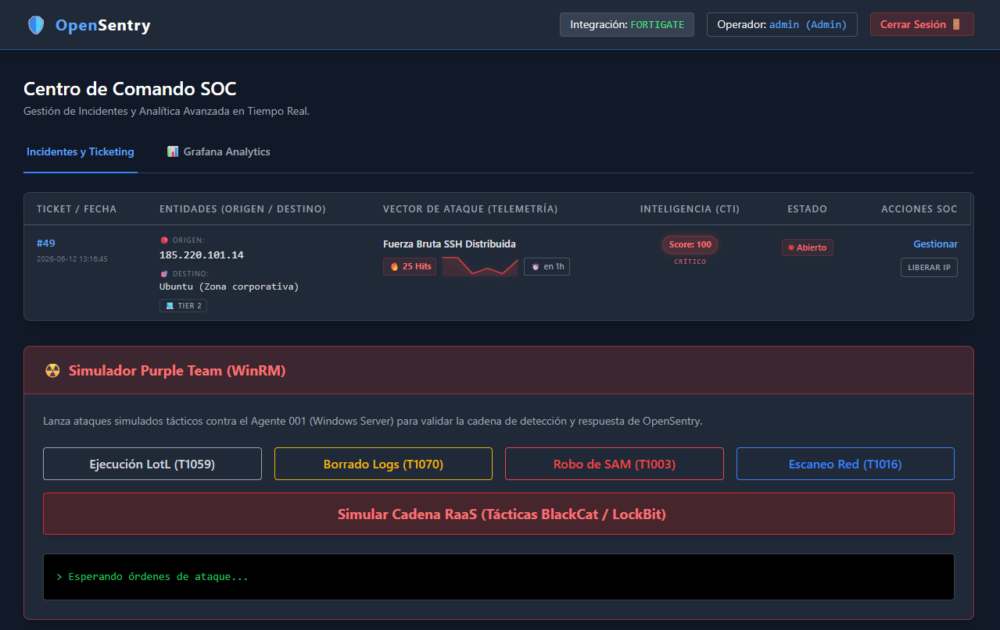
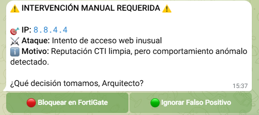
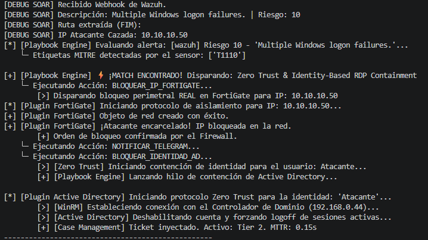

# 🛡️ OpenSentry SOAR

> **Status:** 🚧 In Active Development / En Desarrollo | **Version:** 0.8.0-beta

## 📖 Visión General del Proyecto
**OpenSentry** es una plataforma SOAR (Security Orchestration, Automation, and Response) personalizada y de código abierto. Está diseñada para automatizar el ciclo de vida de respuesta a incidentes (DFIR) y reducir la fatiga de alertas de los analistas de Nivel 1 (L1 SOC Analysts).

El objetivo de este proyecto es demostrar cómo integrar de forma programática soluciones EDR, Firewalls Perimetrales, y Threat Intelligence (CTI) mediante un motor de decisiones desacoplado basado en playbooks YAML, ahora potenciado con capacidades de simulación (Purple Team), Inteligencia Artificial local y ChatOps interactivo.

*Vista previa del Case Management Dashboard con Sparklines de telemetría y módulo Purple Team.*

## 🏗️ Arquitectura del Laboratorio SOC
Las pruebas de integración y respuesta activa se están desarrollando sobre un entorno corporativo simulado en VMware:
* **SIEM / EDR:** Wazuh Manager (Ubuntu) y Wazuh Agents (Motor YARA integrado).
* **Gestión de Identidad:** Windows Server 2022 (Active Directory).
* **Seguridad Perimetral:** FortiGate Firewall.
* **Bóveda de Secretos:** HashiCorp Vault.
* **Inteligencia de Amenazas (CTI):** VirusTotal, AbuseIPDB, AlienVault OTX, IP-API.
* **Motor LLM Local:** Ollama (Llama 3).
* **Red Team / Threat Hunting:** Kali Linux.
* **Core del SOAR:** Python 3 (Flask, SQLite, APScheduler, Paramiko, WinRM).

## ✨ Capacidades Desarrolladas (Core Engine)

**🔐 Gestión de Secretos Zero Trust (HashiCorp Vault)**
* **Cero Credenciales en Disco:** El archivo `.env` ha sido totalmente purgado. La arquitectura no "conoce" las contraseñas.
* **Identidad Máquina-a-Máquina (AppRole):** Autenticación dinámica usando credenciales temporales.
* **Principio de Mínimo Privilegio (PoLP):** Secretos entregados bajo políticas estrictas de *Read-Only*.
* **Network Binding:** Protección anti-robo de tokens. Si se compromete el entorno, Vault deniega cualquier petición que no provenga de la IP autorizada del servidor local del SOC.

**🧠 Inteligencia Autónoma y RAG (Sentry AI)**
* **Motor RAG 100% Local:** Integración de un LLM (Llama 3) que escanea y comprende en tiempo real el código fuente (`app.py`), plantillas HTML, plugins y playbooks garantizando total privacidad (nada sale a APIs de terceros).
* **Generación de Playbooks "Al Vuelo":** Capacidad para analizar el ecosistema y redactar automáticamente la lógica de contención en YAML ante la adición de nuevas reglas de detección.

**🤖 ChatOps y Human-in-the-Loop (Telegram API)**
* **Intervención Manual Dirigida:** Ante comportamientos heurísticos sin firmas claras, el SOAR detiene la ejecución autónoma y envía la telemetría CTI al dispositivo móvil del analista.
* **Resolución Interactiva:** El administrador dicta la decisión defensiva definitiva (bloquear perimetralmente o ignorar falso positivo) mediante botones interactivos directamente desde el chat.

*Interfaz de ChatOps en Telegram solicitando autorización manual interactiva.*

**📧 Análisis Autónomo de Phishing (Inbox Monitor)**
* **Revisión IMAP Continua:** Conexión automatizada al buzón de reportes de los empleados.
* **Extracción Segura en RAM:** Descarga de archivos adjuntos directamente en memoria (sin tocar el disco duro) para el cálculo de hashes SHA-256.
* **Enrutamiento Inteligente:** Cruza URLs y adjuntos con VirusTotal y clasifica automáticamente los correos moviéndolos a las carpetas `SOAR_Malware` o `SOAR_Limpios`, detonando el SOAR en caso crítico.

**⚔️ Módulo de Simulación Continua (Purple Team)**
* **Inyección de Payloads WinRM:** Capacidad de lanzar ataques simulados basados en MITRE ATT&CK directamente desde el Dashboard contra los agentes.
* **Cadena APT Híbrida (RaaS):** Simulación automatizada *Cross-Platform* que extrae credenciales LAPS en RAM, envía Spear-Phishing (SMTP), realiza movimiento lateral (Win -> Linux) y simula exfiltración de datos.
* **Validación de Cadena Completa:** Permite auditar en tiempo real si las actualizaciones del SO rompen las reglas de detección.

**🎯 Motor de Detección Táctica (Sigma -> Wazuh)**
Integración nativa de reglas universales Sigma en el cerebro de Wazuh con playbooks de contención específicos para:
* **Process Creation:** Detección de binarios maliciosos y técnicas LotL.
* **Sysmon:** Monitorización avanzada de telemetría de Windows.
* **Network Connection:** Detección de comunicaciones anómalas (C2) y reconocimiento (T1016).
* **Credential Access:** Dumping de memoria y colmenas SAM (T1003).
* **PowerShell:** Monitorización de ofuscación y ejecución en memoria.

**🛡️ Seguridad Perimetral y de Red (FortiGate)**
* **Contención Dinámica en Firewall:** Bloqueo autónomo del perímetro ante intentos de intrusión externa.
* **Deduplicación de Estado:** El motor analiza el estado de la red cruzando `Entidad + Vector de Ataque` (Ventana 15s), ignorando alertas concurrentes para proteger al Firewall de tormentas de logs.

*Inyección dinámica de atacantes en el Address Group de bloqueo del firewall perimetral.*

**💻 Seguridad de Endpoints, Identidades y DFIR**
* **Triaje Forense Dinámico:** Ante alertas críticas, el SOAR ordena a Wazuh un volcado de memoria. Realiza una **pausa táctica de 4 segundos** para recolectar caché DNS y conexiones Netstat en un `.txt`, que Sentry AI procesa para extraer un resumen limpio.
* **Aislamiento con "Lifeline":** Reconfiguración del Firewall de Windows aislando el host, pero manteniendo un túnel abierto hacia la IP del SOC para preservar telemetría.
* **Escudo Fail-Safe Tier 0:** Listas blancas (CMDB) que abortan dinámicamente aislamientos de red sobre servidores críticos (Domain Controllers) para evitar DoS auto-infligidos.
* **Contención de Cuentas PoLP:** Deshabilitación de identidades en AD mediante una cuenta de servicio (`svc_opensentry`) con delegación granular.

🎥 **Demostración Práctica:** [Ver vídeo de intercepción de ataque de Fuerza Bruta (CrackMapExec) con Logoff automático del Atacante.](docs/video_crackmapexec_logoff.mp4)

*Log de orquestación del core de OpenSentry: Contención perimetral (FortiGate) y aislamiento Zero Trust de identidad (Active Directory) ejecutados de forma autónoma con un MTTR de 0.15 segundos.*

**🕵️‍♂️ Threat Intelligence & Cyber Deception**
* **CTI Multiplexer:** Consulta simultánea a VirusTotal, AbuseIPDB y AlienVault OTX.
* **Autopsia OSINT:** Inyección dinámica de metadatos (Geolocalización, ISP, ASN) mediante `ip-api.com` directamente en las notas del caso L1.
* **Honeytokens:** Archivos y credenciales señuelo monitorizados vía FIM y SACLs. El acceso dispara alertas MITRE T1083 que el SOAR contiene de inmediato.

**⚙️ Operaciones SOC y Case Management**
* **Decay Engine (Motor de Decaimiento):** Algoritmo que reduce matemáticamente la severidad ("hits" y reputación) de las campañas en letargo por inactividad.
* **Telemetría Visual (Sparklines):** Renderizado de mini-gráficas SVG en el frontend para mostrar la evolución de ataques distribuidos.
* **Visualización SOC Avanzada (Grafana):** Conexión de la base de datos a Grafana para proyectar mapas de calor y telemetría de atacantes en tiempo real.
* **Motor de Reportes Ejecutivos:** Generación automática de informes mensuales (PDF) con métricas de negocio y tiempos de respuesta (MTTD/MTTR).
* **RBAC Dashboard (Control de Acceso):** Sistema de Login para separar vistas y permisos entre Analistas de Nivel 1 (Solo lectura/Triaje) y Administradores (Full access y Liberaciones).

## 🚀 Pruebas de Concepto (PoC) Exitosas
- [x] Transición exitosa de credenciales locales a bóveda Zero Trust con HashiCorp Vault.
- [x] Despliegue y validación de reglas Sigma contra ataques de red y procesos.
- [x] Ejecución de simulacros Purple Team con medición de tiempos de contención (MTTD/MTTR ~0.15s).
- [x] Creación de playbooks autónomos mediante IA generativa en local.
- [x] Bloqueo perimetral automático (FortiGate) y despliegue de Honeytokens.
- [x] Intercepción de ataque Ransomware detectando destrucción de *Shadow Copies*.
- [x] Dashboards en tiempo real integrados con Grafana y Sparklines SVG.
- [x] Suspensión de cuenta de usuario en el Domain Controller mediante WinRM.
- [x] Generación de reportes PDF mensuales y clasificación de Phishing (IMAP).

## 🗺️ Roadmap Futuro
- [ ] **Threat Intelligence API Wrapper:** Integración del feed comercial de *TSSmonitor* (Nodos Tor, Botnets, URLs activas) para dotar al motor SOAR de reputación proactiva antes de que el tráfico alcance el perímetro.
- [ ] **Despliegue Contenerizado:** Creación de un entorno `docker-compose.yml` para aislar el motor Python, la base de datos y la IA en contenedores independientes.

---
*Nota: El código fuente se publicará de forma progresiva a medida que los módulos superen la fase de pruebas y se auditen.*

📫 **Conecta conmigo en LinkedIn:** [Francisco José Alpuente Santos](https://www.linkedin.com/in/francisco-jose-alpuente-santos-/)