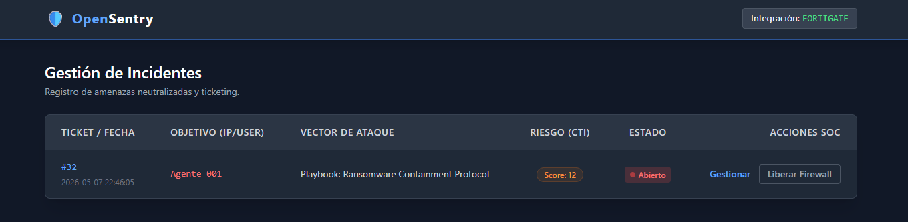

# 🛡️ OpenSentry SOAR

> **Status:** 🚧 In Active Development / En Desarrollo | **Version:** 0.5.0-alpha

## 📖 Visión General del Proyecto
**OpenSentry** es una plataforma SOAR (Security Orchestration, Automation, and Response) personalizada y de código abierto. Está diseñada para automatizar el ciclo de vida de respuesta a incidentes (DFIR) y reducir la fatiga de alertas de los analistas de Nivel 1 (L1 SOC Analysts).

El objetivo de este proyecto es demostrar cómo integrar de forma programática soluciones EDR, Firewalls Perimetrales, y Threat Intelligence (CTI) mediante un motor de decisiones desacoplado basado en playbooks YAML.

*Vista previa del Case Management Dashboard.*

## 🏗️ Arquitectura del Laboratorio SOC
Las pruebas de integración y respuesta activa se están desarrollando sobre un entorno corporativo simulado en VMware:
* **SIEM / EDR:** Wazuh Manager (Ubuntu) y Wazuh Agents.
* **Gestión de Identidad:** Windows Server 2022 (Active Directory).
* **Seguridad Perimetral:** FortiGate Firewall.
* **Red Team / Threat Hunting:** Kali Linux.
* **Core del SOAR:** Python 3 (Flask, SQLite, APScheduler).

## ✨ Capacidades Desarrolladas (Core Engine)

**🛡️ Seguridad Perimetral y de Red (FortiGate)**
* **Contención Dinámica en Firewall:** Integración vía API REST para inyectar *Address Objects* en Blacklists. Bloqueo autónomo del perímetro ante intentos de intrusión externa.
* **Deduplicación de Estado:** El motor analiza el estado de la red antes de actuar, ignorando alertas concurrentes si la IP ya está bloqueada, protegiendo al Firewall de ataques de denegación de servicio (DoS) internos.

*Inyección dinámica de atacantes en el Address Group de bloqueo del firewall perimetral.*

**💻 Seguridad de Endpoints (Wazuh EDR & Windows)**
* **Aislamiento de Red con "Lifeline":** Ante comportamientos Zero-Day, se despliegan scripts en PowerShell que reconfiguran el Firewall de Windows aislando el host, pero manteniendo un túnel WinRM/API abierto hacia la IP del SOC para preservar la telemetría y respuesta remota.
* **Terminación de Procesos en Memoria:** Interrupción en tiempo real de binarios maliciosos (kill process) a nivel de SO tras confirmar un IoC.

**🔐 Gestión de Identidades (Active Directory)**
* **Contención de Cuentas Comprometidas:** Deshabilitación de identidades en tiempo real vía WinRM.
* **Arquitectura PoLP (Principio de Mínimo Privilegio):** Ejecución a través de una cuenta de servicio dedicada (`svc_opensentry`) con delegación granular sobre el atributo `userAccountControl` y restricción de descriptores de seguridad (SDDL), evitando el uso de cuentas Domain Admin.

**🕵️‍♂️ Threat Intelligence & Cyber Deception**
* **CTI Multiplexer & Auto-Enriquecimiento:** Consulta simultánea a APIs externas (VirusTotal, AbuseIPDB, AlienVault OTX) para nutrir el ticket con OSINT, geolocalización e ISP de los atacantes.
* **Honeytokens (Defensa Activa):** Archivos señuelo monitorizados vía FIM y SACLs de Windows. El acceso no autorizado dispara alertas MITRE T1083 (Discovery) que el SOAR contiene de inmediato.

**⚙️ Operaciones SOC (Case Management)**
* **Retención Dinámica (Auto-Cuarentenas):** Cronjobs sobre base de datos SQLite para purgar cuarentenas basándose en políticas de riesgo: Escáneres (4h), Malware/C2 (24h), Movimiento Lateral (Bloqueo Indefinido).
* **Escudo Fail-Safe (Whitelisting):** Mecanismo de lista blanca con soporte de rangos CIDR para abortar contenciones que afecten a la subred de gestión o servidores críticos.
* **Motor de Playbooks YAML Desacoplado:** Arquitectura "codeless" para el analista L1. Las reglas de respuesta se definen modificando simples archivos de texto.
* **ChatOps (Human-in-the-loop):** Integración con Telegram para notificaciones ricas y solicitud de autorización en acciones críticas.

*Ejemplo de Playbook YAML para contención autónoma de Ransomware.*

## 🚀 Pruebas de Concepto (PoC) Exitosas
- [x] Bloqueo perimetral automático (FortiGate) de atacantes externos simulando fuerza bruta SSH.
- [x] Intercepción de ataque Ransomware (Zero-Day mapping) vía reglas Sysmon Regex detectando destrucción de *Shadow Copies* (`vssadmin`).
- [x] Aislamiento de host comprometido en milisegundos manteniendo el túnel de monitorización del SIEM.
- [x] Suspensión de cuenta de usuario en el Domain Controller mediante WinRM con cuenta de servicio de mínimos privilegios.
- [x] Despliegue de Honeytokens con auditoría avanzada de acceso a objetos y respuesta autónoma.
- [x] Auto-resolución y clasificación de correos de Phishing trabajando la evidencia directamente en memoria RAM.

*Demostración de Respuesta Activa: Aislamiento de red automático tras alerta crítica.*

## 🗺️ Roadmap Futuro
- [ ] **Bóveda de Secretos Enterprise:** Migración de credenciales de texto plano a HashiCorp Vault para integración DevSecOps.
- [ ] **Despliegue Contenerizado:** Creación de un `docker-compose.yml` para aislar el motor Python, la base de datos y los cronjobs en contenedores independientes.
- [ ] **Threat Intelligence Sharing:** Integración con MISP (Malware Information Sharing Platform) para compartir IOCs neutralizados con la comunidad.

---
*Nota: El código fuente se publicará de forma progresiva a medida que los módulos superen la fase de pruebas y se implementen medidas de seguridad para los secretos de la aplicación.*

📫 **Conecta conmigo en LinkedIn:** (https://www.linkedin.com/in/francisco-jose-alpuente-santos-/)